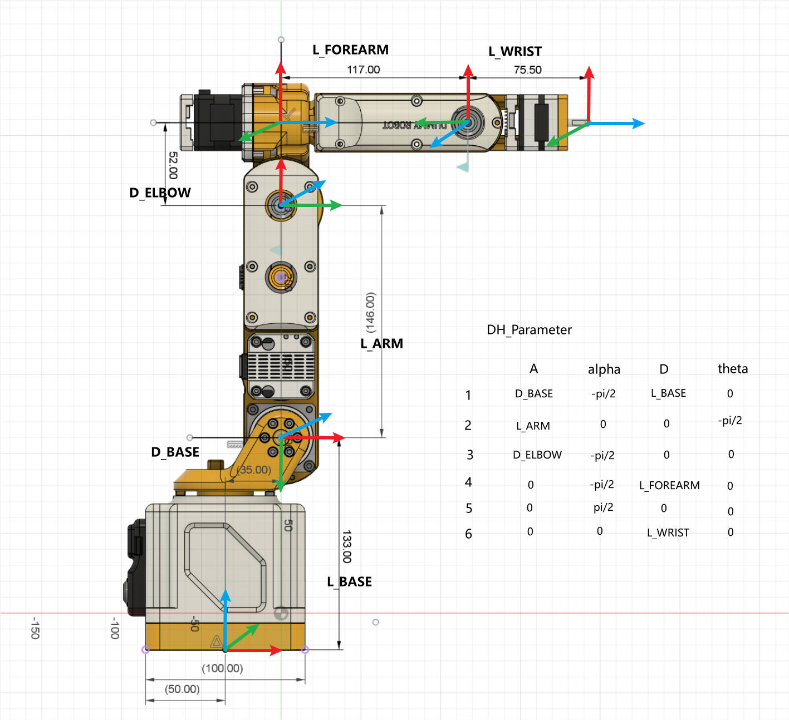
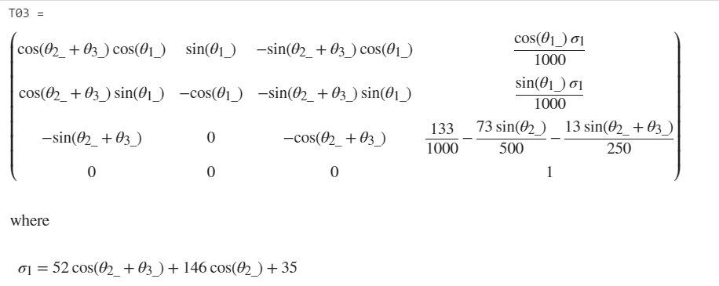
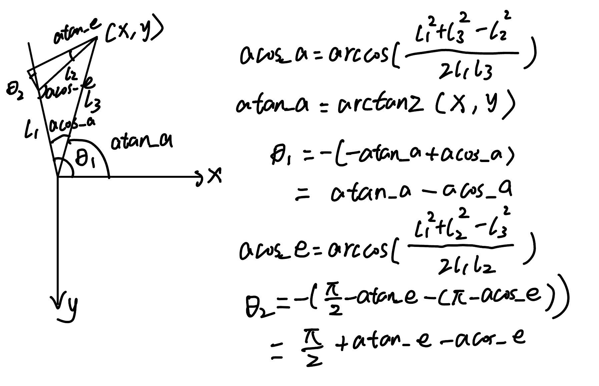
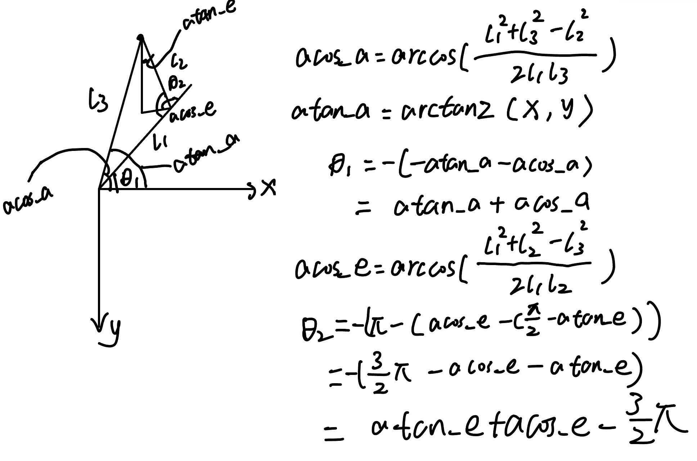
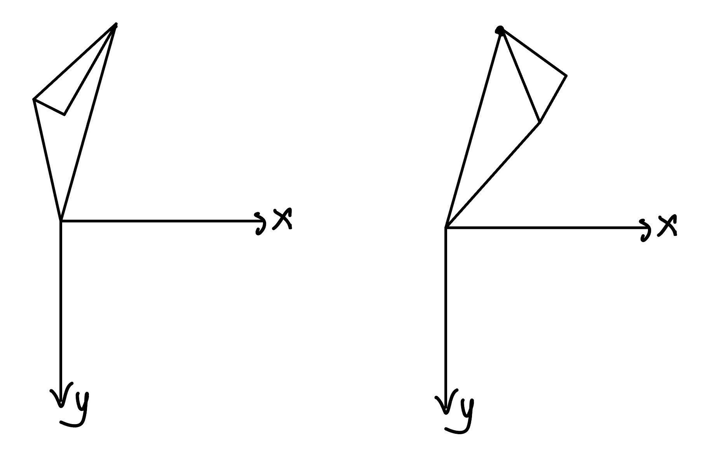
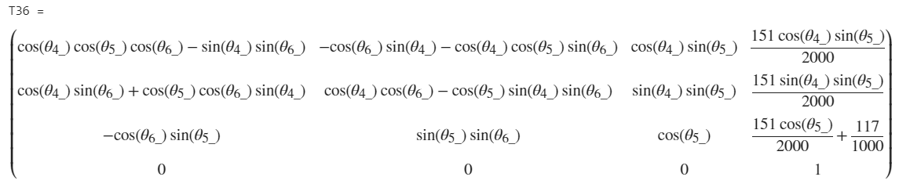

# 机械臂正逆运动学求解过程

以dummy机械臂的SDH table为例记录求解过程

## 正运动学

对于常见的机械臂来说，可将6轴分为两个三轴，上图机械臂可分为下三轴拟人臂和上三轴球形臂。

正运动学比较简单，为了减少计算量，一般不选择直接对齐次变换矩阵相乘。

而是采用先对6个旋转矩阵相乘即可得到末端的旋转矩阵，再计算每个连杆的长度对末端坐标的影响

$^6P = ^0_1R*L1+^0_2R*L2+^0_3R*L3+^0_4R*L4+^0_5R*L5+^0_6R*L6$

注意这里的Li是三维矢量，表示连杆i在i坐标系中的坐标，基于如下公式

$^AP = ^AP_{BORG}+^A_BR*^BP$

这里要把B坐标系看成与A坐标系重合，再去看P点的坐标，对应上图也就是把坐标系1移动到坐标系0处，再看关节2的坐标的位置，就可以得到L1

## 逆运动学

对于满足pieper构型的机械臂，可将其拆分为拟人臂和球形臂两部分。拟人臂决定末端位置，球形臂决定末端姿态。

求解已知条件是末端位置和姿态

求解步骤：

1、根据末端位置和姿态以及连杆6计算坐标系5对应的坐标和姿态

2、坐标系5的位置就是拟人臂的位姿，根据前三轴的齐次变换矩阵求解三个关节角

3、旋转矩阵$^6_3$R就是球形臂形成的旋转矩阵

### 拟人臂

使用MATLAB计算齐次变换矩阵T03

观察这个矩阵可以看出来θ1可以直接通过坐标x和y求出来，但需要注意当x、y都是0的时候θ1为任意值，其他情况就可以直接使用atan2来计算。

对于θ2和θ3，我们需要从几何的角度来推导，在θ1给定时总共有两种情况。在θ1已知后，我们可以计算坐标系4在坐标系1中的坐标，还是使用连杆和减去一个连杆得到这个坐标。下图给出推导过程：

### 球形臂

使用MATLAB计算齐次变换矩阵T63

观察发现，θ5可以由三行三列的值求出来