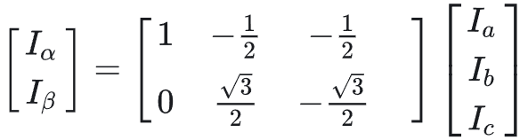
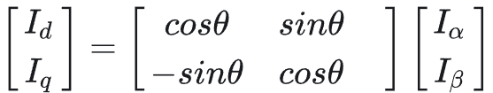

# 无刷电机FOC学习记录

该文档只用来记录自己在学习FOC时遇到不容易理解的地方，以及自己对它的理解

## 克拉克变换

克拉克变换将三个相的电流矢量分到新的$\alpha$-$\beta$正交坐标系中，公式如下

这里先不对其进行解释

## 帕克变换

帕克变换将$\alpha$-$\beta$固定坐标系中的电流矢量变换到跟随电角度变换的D-Q非固定坐标系中，这个坐标系跟随转子一起旋转，变换公式如下

这里的$\theta$就是所谓的电角度，也就是D轴与$\alpha $轴的夹角

## 电角度与机械角度

电机旋转过程中的电角度与机械角度的关系是
$$
电角度 = 机械角度*单个相绕组个数
$$
这里的单个相绕组个数指的是定子绕组中A单个相的绕组个数，等于定子绕组个数除以3。

分析这个问题可以以定子6绕组，转子4相电机出发，取电角度变换值为$\pi/3$的时候，机械角度的变换值为$\pi/6$。

另一种理解电角度和机械角度的方式是考虑三个线圈电流波形为相差$\frac{2\pi}{3}$的正弦波，若电角度是机械角度的2倍，电流波形每完成2个周期，电机旋转1圈。

## 三相正弦电流对应的合成电流矢量总是沿Q轴方向

这个认为定义出来的，这样的好处是所有的电流都用来提供力矩，效率最大化。

在这个定义的基础上，我们可以继续证明三相正弦电流波形的横坐标与电角度的关系

## 三相正弦电流波形的横坐标与电角度的关系

先说结论，**三相正弦电流波形的横坐标等于电角度的负数**

推导如下
$$
I_A = sin(\omega t)\\
I_B = sin(\omega t +\frac{2\pi}{3})\\
I_C = sin(\omega t -\frac{2\pi}{3})
$$

$$
I_\alpha = I_A-\frac{1}{2}I_B-\frac{1}{2}I_C\\
I_\beta = \frac{\sqrt{3}}{2}I_B-\frac{\sqrt{3}}{2}I_C\\
$$

计算结果得到
$$
I_\alpha = \frac{3}{2}sin(\omega t)\\
I_\beta = \frac{3}{2}cos(\omega t)
$$
当$\omega t_1= \frac{\pi}{2}$和$\omega t_2= \frac{2\pi}{3}$时

对应电流矢量就是Q轴的方向，而电角度定义为D轴与α轴的夹角，要将电流矢量的角度减去$\frac{\pi}{2}$，也就是$-\frac{\pi}{2}$和$-\frac{2\pi}{3}$

## 如何使用14位编码器测出的机械角度实现闭环速度控制

对于速度控制主要包含两部分，一部分是改变相电流大小，另一部分是根据当前位置，给定下一控制周期电流矢量的方向，也就是有一个提前的角度。为了实现力矩最大，这个提前量应该在当前电角度的基础上加或减$\frac{\pi}{2}$，加对应顺时针旋转，减对应逆时针旋转。

编码器获得机械角度后，计算电角度，将电角度