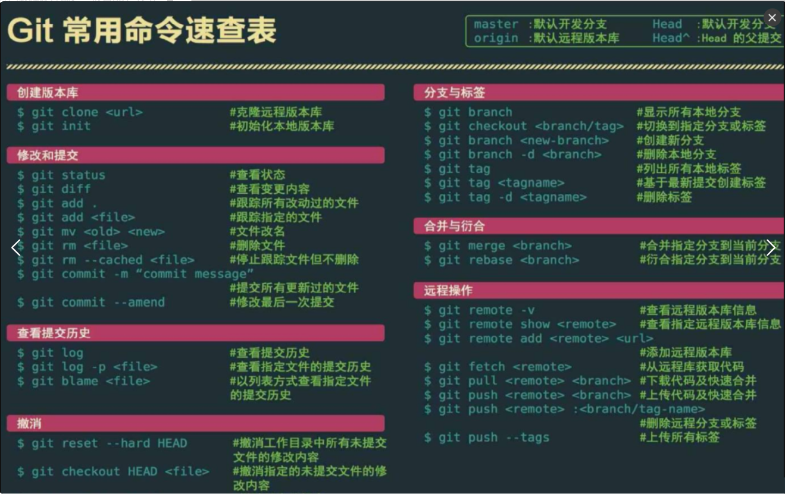
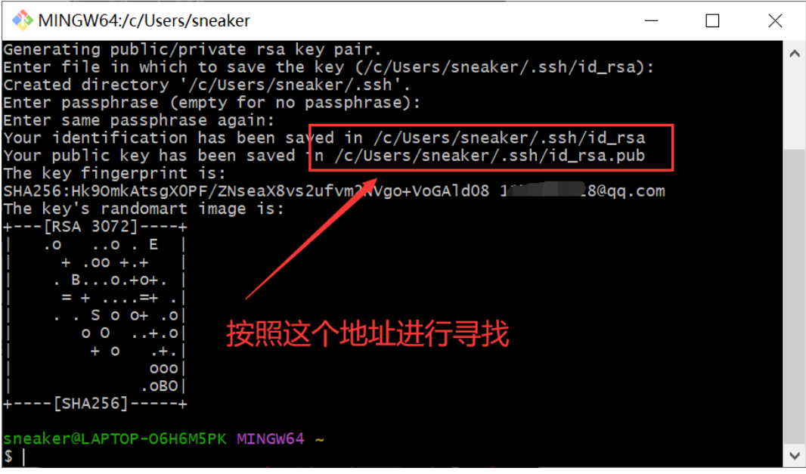
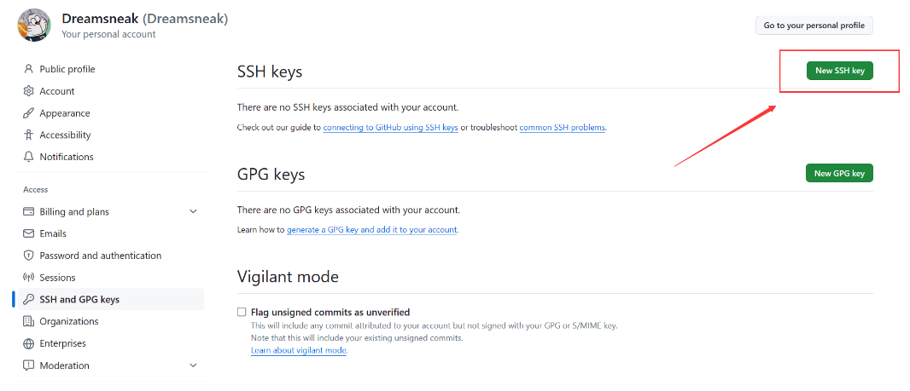
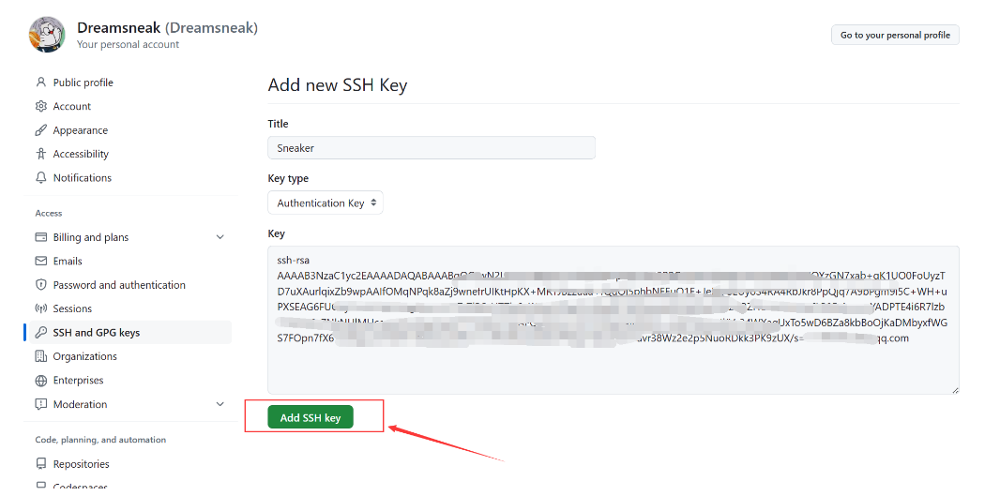
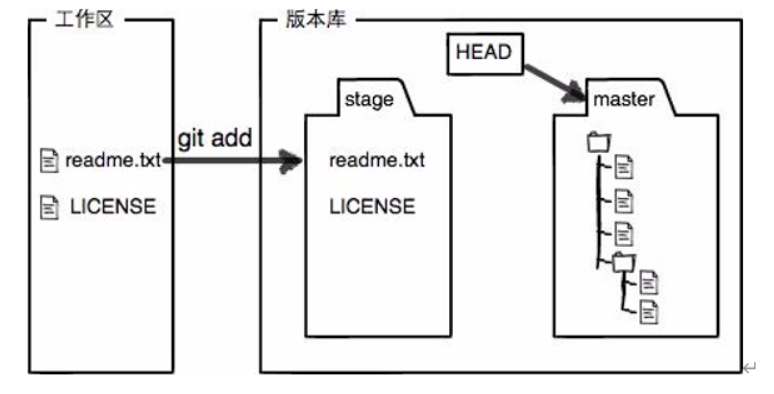
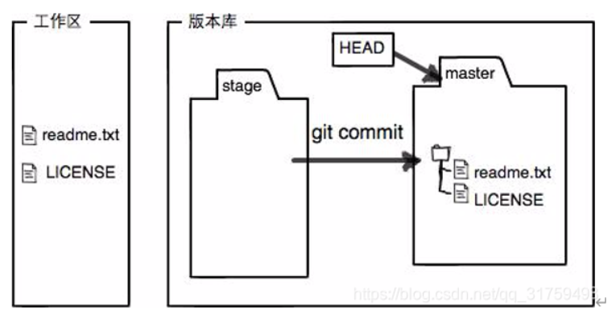
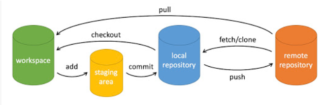

# git版本控制使用

参考blog：

[Github入门教程，适合新手学习（非常详细）_github教程-CSDN博客](https://blog.csdn.net/black_sneak/article/details/139600633)

[版本管理——github的使用_github版本管理-CSDN博客](https://blog.csdn.net/qq_31759493/article/details/109191996?ops_request_misc=%7B%22request%5Fid%22%3A%227B55F2B6-B8C3-41A8-9DF1-7682B6ED3EEE%22%2C%22scm%22%3A%2220140713.130102334..%22%7D&request_id=7B55F2B6-B8C3-41A8-9DF1-7682B6ED3EEE&biz_id=0&utm_medium=distribute.pc_search_result.none-task-blog-2~all~sobaiduend~default-1-109191996-null-null.142^v100^pc_search_result_base2&utm_term=github版本控制&spm=1018.2226.3001.4187)

## 基本功能

Git常用命令



### 绑定配置

Git与Github的绑定，绑定账户后可以方便拉去推送private仓库

```python
cd ~/.ssh
```

如果没有上面的文件夹需要创建ssh key

```python
 ssh-keygen -t rsa -C “git账号”
```

git账号就是邮箱，然后进行三次回车



上图中文件夹里面存储的是两个 **ssh key** 的秘钥，**id_rsa.pub** 文件里面存储的是公钥，**id_rsa** 文件里存储的是私钥，不能告诉别人。**打开 id_rsa.pub 文件，复制里面的内容。**

接下需要登录到自己的 GitHub 上边添加这个密匙；



填写名字并且填写复制的公钥（id_rsa.pub内容），添加后配置完成。



回到Git Bash，输入下面的代码可以查看是否绑定成功，再输入yes就说明成功了

```python
ssh -T git@github.com
```

剩下简单配置

```python
git config --global user.name “gitname”
git config --global user.email “git邮箱”
```

### 常用操作及解释

#### 最常用的就是**push**和**pull**

```python
git push origin master
git pull origin master
```

#### 克隆仓库

```python
git clone 仓库地址
```

#### 提交代码

提交代码前还需要使用下面的命令添加要提交的文件

```python
git add 文件名
```


```python
git commit -m "提示信息"
```

## 进阶操作

github版本控制是集中式版本控制系统，用户拉去服务器数据进行修改，完成任务后推送到服务器

### 一台电脑管理多个sshkey

1、生成不同的密钥对： 使用ssh-keygen命令为每个服务器生成独立的SSH密钥对。例如，分别为服务器A和服务器B生成密钥对：

```python
ssh-keygen -t rsa -C “your-email@example.com” -f ~/.ssh/id_rsa_server_a
```

```python
ssh-keygen -t rsa -C “your-email@example.com” -f ~/.ssh/id_rsa_server_b
```

2、配置SSH配置文件： 编辑或创建~/.ssh/config文件，以便为每个服务器指定不同的私钥：

配置服务器A

```python
Host server-a-hostname-or-ip
HostName server-a-host.example.com
User your-username-on-server-a
IdentityFile ~/.ssh/id_rsa_server_a
```

配置服务器B

```python
Host server-b-hostname-or-ip
HostName server-b-host.example.com
User your-username-on-server-b
IdentityFile ~/.ssh/id_rsa_server_b
```

解释：server-a-hostname-or-ip和server-b-hostname-or-ip是你为两个服务器定义的别名，用于在命令行中快速引用它们。而HostName字段填写实际的服务器域名或IP地址，User字段填写你在对应服务器上的用户名，IdentityFile则指向相应的私钥文件。

再把公钥上传到各自服务器

当你通过SSH连接Git服务器时，只需使用配置好的别名，SSH就会自动使用正确的私钥进行身份验证：git clone ssh://server-a-hostname-or-ip/repo.git
git clone ssh://server-b-hostname-or-ip/another-repo.git
bash这样，你的笔记本就可以根据目标服务器智能地切换私钥来进行认证了。

### 工作区、暂存区、版本库

图示git add和git commit操作





三者之间的操作示意图



名词解释：

- workspace：工作区,就是你在电脑里能看到的目录
- staging area：暂存区/缓存区,英文叫 stage 或 index。一般存放在 .git 目录下的 index 文件（.git/index）中，所以我们把暂存区有时也叫作索引（index）。
- local repository：版本库或本地仓库,工作区有一个隐藏目录 .git，这个不算工作区，而是 Git 的版本库。
- remote repository：远程仓库

## 现代IDE中的git操作

由于大量代码基本在相应的IDE中编写，使用软件自带的git插件更方便，下面以vscode为例介绍。

### 多分支使用

基础部分操作已经介绍完全，简单的push pull在ide中也很容易实现。下面介绍多分支管理，方便修改代码。

本地删除分支的命令-D参数强制删除，用于创建但未被推送或合并的分支

```python
git branch -d 分支名
```

远程删除分支命令

```python
 git push origin --delete 远程分支名
```

### 代码回溯

使用下面命令查看历史所有提交，查看版本id，也提供了提交的信息

```python
git log#详细信息
git log --pretty=oneline#完整hash值，提交备注，仅有一行
git log --oneline#一行，短hash值和提交备注

git log --graph#会展示历史提交的分支路线
```

git log只展示当前HEAD指针及之前的提交版本，下面的git reflog则可以查看所有的提交版本

```python
git reflog
```

版本回溯使用下面命令--hard使本地仓库、暂存区、工作区三者状态一致

```python
git reset --hard 版本号
git reset --hard HEAD^#一个^表示回退一个版本，两个^就是两个版本
git reset --hard HEAD~n#回退n个版本
```

备注：进入分页器需要按q退出