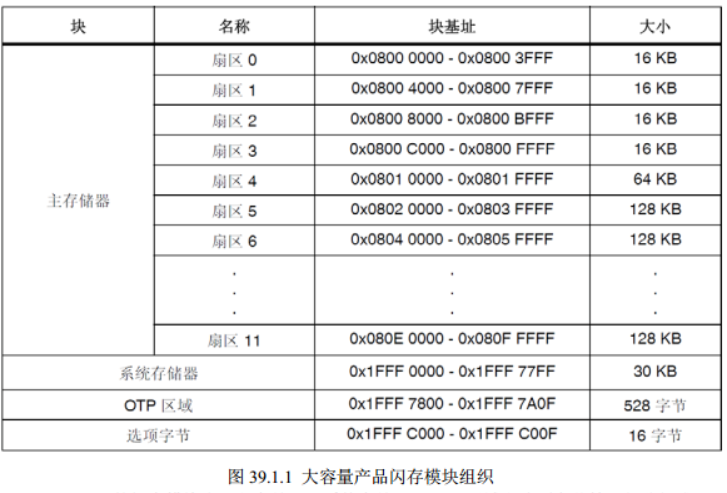

# STM32f407芯片flash使用

参考blog：

[STM32F407 Flash操作笔记_stm32f407 flash读写-CSDN博客](https://blog.csdn.net/xiaogu0322/article/details/78593423)

## 扇区分布情况

擦除方式：扇区擦除（16KB）、正片擦除

我们需要在flash存入数据都是存放在主存储区靠后的地方。

前四个扇区为16KB，扇区4为64KB，剩余扇区为128KB

## 写FLASH操作

