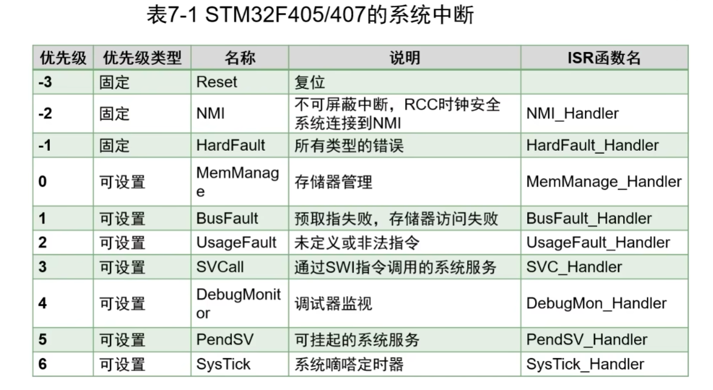
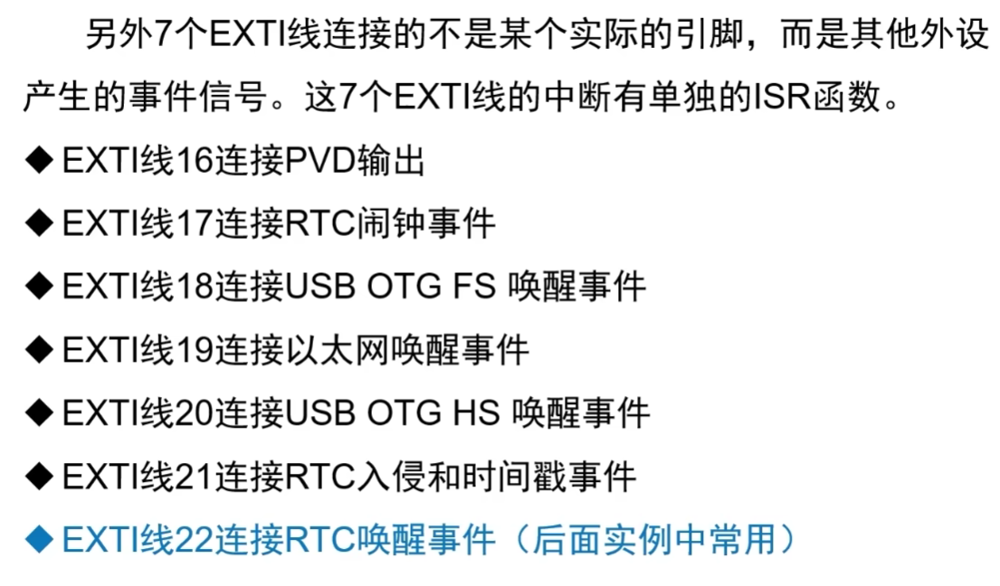

# 中断

## 中断向量表

NVIC嵌套向量中断控制器，82个可屏蔽中断通道，13个系统中断。82个可屏蔽中断和部分系统中断是可以配置优先级的，总共有16个优先级。

ISR中断服务例程，对中断进行相应的函数，每个中断有一个ISR

MCU的启动文件startup_stm32f407xx.s中有这些ISR名称的定义。

### 系统中断

通常一个中断号有多个中断事件源。

### 外部中断

stm32f407有23个外部中断

7个EXTI中断，EXTI0-EXTI4有独立中断号，EXTI5-9和EXTI10-15均为共用中断号，也就是共用ISR函数

另外7个EXTI线不与GPIO相连，而是其他外设产生的事件信号

