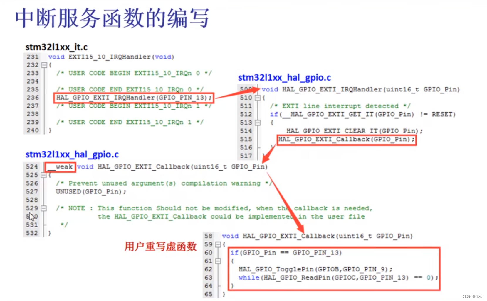

# stm32中断研究

## 概述

stm32的中断主要有系统中断和外部中断。对于外部中断又可以分为GPIO引脚边沿中断和各种外设中断。项目中主要使用外设中断，这里先讲解外设中断。

stm32 hal库中的外设中断的处理逻辑如下如所示：

### 分析

分析以uart为例，通常会有一个USART6_IRQHandler格式的函数名在it.c文件中，这可以看成一个中断矢量，在这个函数里面通常会调用HAL_UART_IRQHandler(&huart6)函数，来区分不同的uart外设，而在HAL_UART_IRQHandler函数内部会根据相应的标志位处理相应的中断，这些定义在hal_uart.c文件中。处理的方式是使用回调函数，回调函数以__weak定义表明可以重定义。

对于有些中断没有预定义的回调函数，例如uart的空闲中断，因此我们一般自己定义回调函数，这部分代码可以参考稚晖君驱动板中uart的处理

## 串口中断

stm32 uart串口主要有以下这些常用中断：

发送完成中断、接收完成中断、接收空闲中断

### 数据运输

uart接收到数据后需要快速搬运到内存中，否则就会被新的数据覆盖，因此使用DMA很有必要。一般使用方式是uart空闲中断配合DMA。

空闲中断的触发逻辑是在接收到数据后的一个字节时间内没有新的数据就会触发空闲中断。我们需要在每次触发空闲中断时调用自己编写的回调函数对DMA搬运好的数据做处理。

注意这里一般不使用DMA的中断，DMA中断并不能达到我们想要的中断时机

### 问题

在调试uart发送功能时要注意不要像Hal_Uart_Transmit_DMA函数中传入局部变量，这样函数在结束的时候会销毁局部变量，导致传输错误。并且由于Hal_Uart_Transmit_DMA非阻塞，所以执行这个函数后不要立刻去修改发送的数组的内容，否则也会造成发送数据错误。