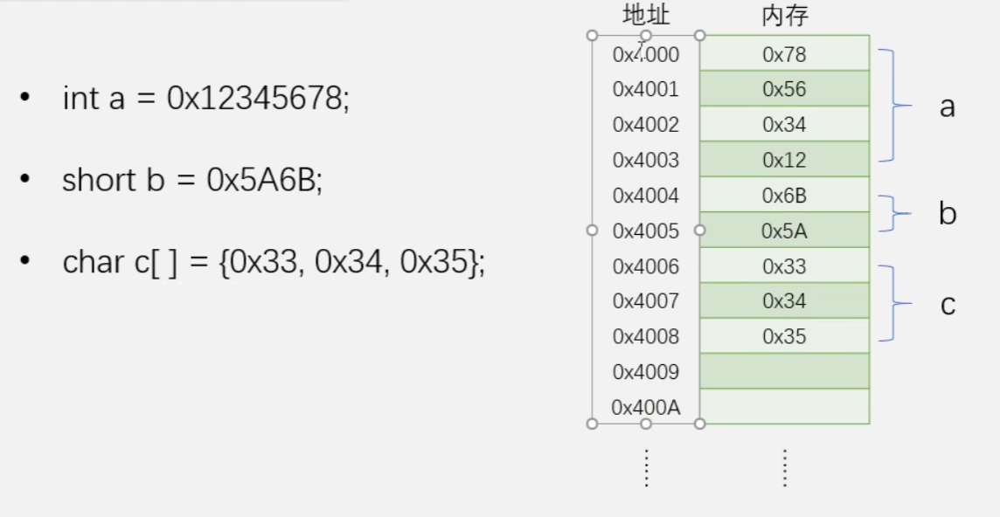
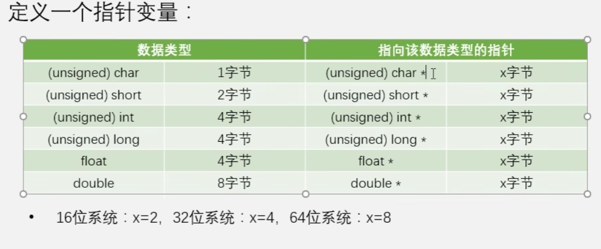
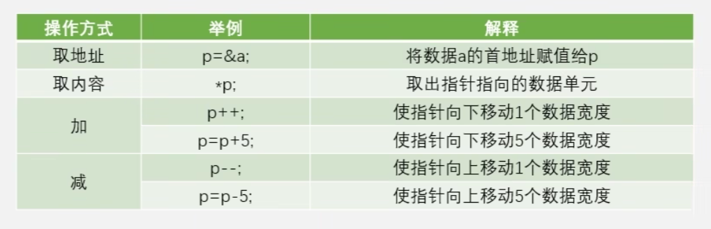
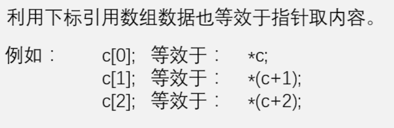
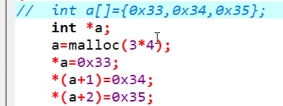

# 指针

## 基础部分

### 计算机存储机制



从这个图可以看出，数据存储为小端模式，数组内数据按顺序存储

### 定义指针

指针又叫指针变量，用于存放其它数据单元（变量、数组、结构体、函数）的**首地址**



指针占用内存只与系统相关，与变量类型无关

### 指针的操作

已有如何定义

```python
int a;
int *p;
```

有如下操作方式：



注意指针加减是移动单位个数据宽度，常用于数组

### 数组与指针

数组名即为指向该数据类型的指针。



下面这两种实现等价



### 注意事项

数组有越界，指针也有越界问题


跨级赋值要使用强制转换

## 指针的应用

### 传递参数

普通值传递函数会自动为参数创建内存再复制过来，对于大量的数据传递值传递效率低下

指针传递参数，指针传递参数的坏处是在函数内可以修改数据，为了避免这个情况会给函数的参数加一个const关键字

直接将需要返回的值用指针变量作为参数传递给函数，实现多返回值

### 传递返回值

返回指针类型，注意一定不要返回局部变量

```c++
*((unsigned char *) 0xF1);
```

理解上面这行代码，先强制转为指针类型，再对指针类型取值


利用指针发送复杂数据类型，以串口发送float数据为例