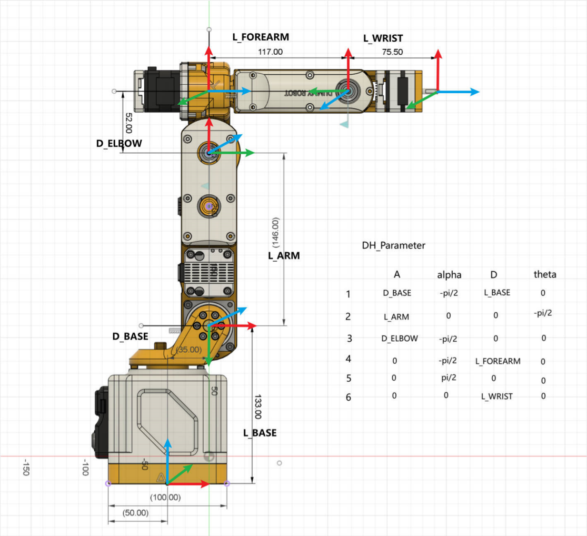

# dummy机械臂手册

此文档记录我的dummy机械臂的一些基本参数

## DH表定义方式

使用标准dh表定义方式

## 一些常用位姿的关节角

resting位置关节角(0,-165.3,90,0,0,0)，笛卡尔坐标(103,0,169,180,-75,0)

homing位置关节角(0,-90,0,0,0,0)，笛卡尔坐标(238,0,331,-180,-90,0)

为了后续连续点运动，采集一些位置点

point1：关节角(60,-120,60,0,-60,0)，笛卡尔坐标(45,77,160,-180,0,60)

point2：关节角(-30,-80,30,0,0,30)，笛卡尔坐标（215.55，-124.45，186.45，-149.15，-41.53，-72.01）

笛卡尔坐标(216,-124,186,-149,-42,-72)

1、2两个点作为一组

point3：关节角(-120,-60,30,60,0,30)，笛卡尔坐标(-127,-220,110,-150,0,150)

point4：关节角(0,-60,30,-60,-30,60)，笛卡尔坐标(230,-37,109,155,-15,-3)

## 每个关节的限位角

关节1：-170-170

关节2：-166--20

关节3：-75-91

关节4：-180-180

关节5：-120-120

关节6：-360-360

