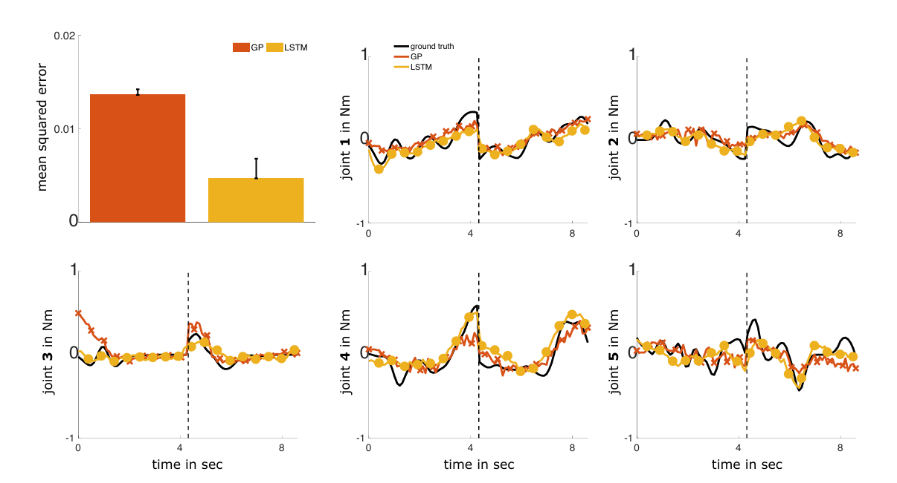

# 论文记录

问题：

并联机械臂执行某个运动的时候，所有关节同时运动还是分为主动和从动？

能否设计一个考虑机械臂连杆模型的无碰撞的激励轨迹算法，无需在获取激励轨迹后验证是否碰撞？

##  Load Parameter Identification for Parallel Robot Manipulator Based on Extended Kalman Filter

基于拓展卡尔曼滤波的并联机器人负载辨识

**什么是modal control？**

无需线性化动力学模型和优化的激励轨迹

对噪声不敏感，无需加速度数据

离线学习，点明了不受限于轨迹的负载辨识作为研究方向

## An overview of dynamic parameter identification of robots

辨识方法：

离线：物理解体、CAD、理论辨识法

在线：自适应控制算法、基于神经网络

辨识模型：

显式动力学模型、隐式动力学模型、能量模型，对于显隐式动力学的解释（是否对动力学模型进行线性化，来自论文8）

辨识算法：

加权最小二乘法、卡尔曼滤波法、最大似然法

轨迹优化：

优化的目标函数、轨迹的基础

顺序辨识

辨识结果的验证和应用

给出了几种验证方法，最常用的还是：在激励轨迹上验证、在测试轨迹上验证

## Deep Learning Aided Dynamic Parameter Identification of 6-DOF Robot Manipulators

先使用动力学模型辨识相对准确的机器人模型，误差力矩小于10%

然后提出UCM方法补偿剩余部分的误差力矩

deep neural network 注意力机制

结果误差力矩小于6%

摩擦模型还是库伦+粘滞，并且包含用神经网络拟合的非线性项

## Dynamicparameteridentification of modular robot manipulators basedonhybridoptimization strategy: genetic algorithm and least squares method

改善的用来优化激励轨迹的遗传算法

库伦粘滞不充分，两步辨识法

利用stribeck模型摩擦力对各系数求偏导，判断系数的影响程度

最后负载辨识准确度97%

##  Inverse Dynamics Modeling of Robotic Manipulator with Hierarchical Recurrent Network

摘要读下来的感觉：通过一种长期的记忆模块，可以为当下的预测提供更多信息

## Learning Inverse Dynamics Models in O(n) time with LSTM networks

长短期记忆网络比高斯过程方法表现更好

实验设计：机械臂推装满水的瓶子5个关节力矩数据

实时预测，考虑了时间效率

模型拟合动力学未建模部分

## *Real-time Deep Learning of Robotic Manipulator Inverse Dynamics

代理方能够预测它结构和与环境交互上的特性

基于学习的方法：直接模型法、间接模型法、distal teacher learning

本论文为直接模型法

文献17和18给出了回归问题的机器学习求解方法综述

使用无负载数据训练，但使用带负载的数据进行验证

不同机械臂收集的数据共同训练？

## Excitation Trajectory Optimization for Dynamic Parameter Identification Using Virtual Constraints in Hands-on Robotic System

强调人机交互的重要性，使用多种末端效应器做实验

基于模型的前馈控制，补偿科氏力、向心力、摩擦力、重力的影响

论文简单介绍了最小参数集和观测矩阵的获取

获取矩阵条件数的封闭形式几乎是不可能的

包含碰撞约束的激励轨迹优化算法

## Robot Arm Dynamics Control Based on Deep Learning and Physical  Simulation 

18年